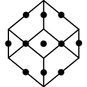

The evolution of PyDOE reflects contributions from multiple individuals and communities over time.

## Scilab Scidoe

The code that eventually became PyDOE was originally developed for Scilab by:

- Copyright (c) 2012–2013, Michael Baudin
- Copyright (c) 2012, Maria Christopoulou
- Copyright (c) 2010–2011, INRIA, Michael Baudin
- Copyright (c) 2009, Yann Collette
- Copyright (c) 2009, CEA, Jean-Marc Martinez

> Sources:  
<a href="https://gitlab.com/scilab/forge/scidoe" style="color: #484848;">gitlab.com/scilab/forge/scidoe</a>  
<a href="https://atoms.scilab.org/toolboxes/scidoe" style="color: #484848;">atoms.scilab.org/toolboxes/scidoe</a>

## PyDOE

The original Scilab code was converted to Python and packaged as PyDOE by:

- Copyright (c) 2014, Abraham D. Lee

This version provided Python users with factorial, fractional factorial, Plackett-Burman, Box-Behnken, central composite, and Latin-hypercube designs.

> Source:  
<a href="https://github.com/tisimst/pyDOE" style="color: #484848;">github.com/tisimst/pydoe</a>

## PyDOE2
PyDOE2 is a fork of PyDOE, created by:

- Copyright (c) 2018, Rickard Sjögren and Daniel Svensson

PyDOE2 added features such as Generalized Subset Designs (GSD) and modernized the codebase.

> Source:  
<a href="https://github.com/clicumu/pyDOE2" style="color: #484848;">github.com/clicumu/pydoe2</a>

## PyDOE3
PyDOE3 is a fork of PyDOE2, created by:

- Copyright (c) 2023, Rémi Lafage

PyDOE3 added several new design families (optimal, sparse, Taguchi, sensitivity), fixed
long-standing bugs, and continued active development.

> Source:  
<a href="https://github.com/relf/pyDOE3" style="color: #484848;">github.com/relf/pydoe3</a>

> All previous versions and forks, including PyDOE2 and PyDOE3, have now been consolidated under a single active repository: <a href="https://github.com/pydoe/pydoe" style="color: #484848;">github.com/pydoe/pydoe</a>
