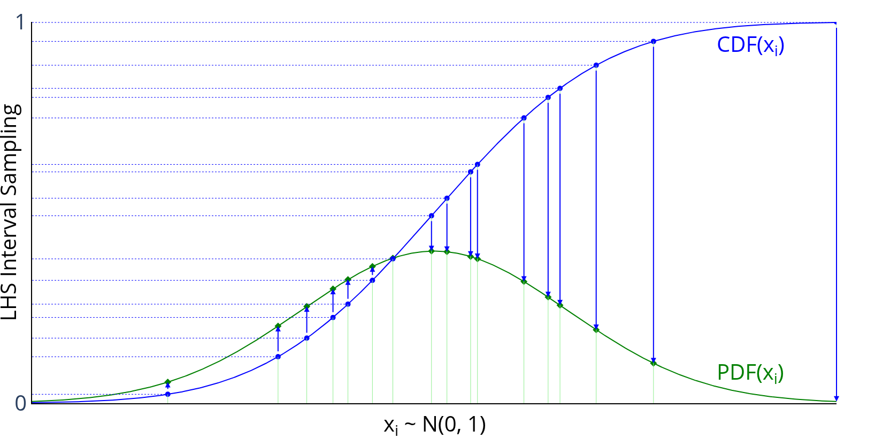

In this section, the following kinds of *randomized designs* will
be described:

- Latin-Hypercube
- Random K-Means
- Random Uniform

!!! hint
    All available designs can be accessed after a simple import statement:

    ```pycon
    >>> from pyDOE3 import lhs, random_k_means, random_uniform
    ```

## Latin-Hypercube (`lhs`) {#latin-hypercube}


Latin-hypercube designs can be created using the following simple syntax:

```python
lhs(n, [samples, criterion, iterations])
```

where

* **n**: an integer that designates the number of factors (required)
* **samples**: an integer that designates the number of sample points to
  generate for each factor (default: n)
* **criterion**: a string that tells `lhs` how to sample the points
  (default: None, which simply randomizes the points within the intervals):

  - "center" or "c": center the points within the sampling intervals
  - "maximin" or "m": maximize the minimum distance between points, but
    place the point in a randomized location within its interval
  - "centermaximin" or "cm": same as "maximin", but centered within the
    intervals
  - "correlation" or "corr": minimize the maximum correlation coefficient
  - "lhsmu" : Latin hypercube with multifimensional Uniformity. Correlation between
     variable can be enforced by setting a valid correlation matrix. Description of the
     algorithm can be found in [*Latin hypercube sampling with multidimensional uniformity*](https://doi.org/10.1016/j.jspi.2011.09.016).

The output design scales all the variable ranges from zero to one which
can then be transformed as the user wishes (like to a specific statistical
distribution using the [`scipy.stats.distributions`](http://docs.scipy.org/doc/scipy/reference/stats.html) `ppf` (inverse
cumulative distribution) function. An example of this is [shown below](#statistical_distribution_usage).

For example, if I wanted to transform the uniform distribution of 8 samples
to a normal distribution (mean=0, standard deviation=1), I would do
something like:

```pycon
>>> from scipy.stats.distributions import norm
>>> lhd = lhs(2, samples=5)
>>> lhd = norm(loc=0, scale=1).ppf(lhd)  # (1)!
```

1. this applies to both factors here

Graphically, each transformation would look like the following, going
from the blue sampled points (from using `lhs`) to the green
sampled points that are normally distributed:



### Examples

A basic 4-factor latin-hypercube design:

```pycon
>>> lhs(4, criterion='center')
array([[ 0.875,  0.625,  0.875,  0.125],
       [ 0.375,  0.125,  0.375,  0.375],
       [ 0.625,  0.375,  0.125,  0.625],
       [ 0.125,  0.875,  0.625,  0.875]])
```

Let's say we want more samples, like 10:

```pycon
>>> lhs(4, samples=10, criterion='center')
array([[ 0.05,  0.05,  0.15,  0.15],
       [ 0.55,  0.85,  0.95,  0.75],
       [ 0.25,  0.25,  0.45,  0.25],
       [ 0.45,  0.35,  0.75,  0.45],
       [ 0.75,  0.55,  0.25,  0.55],
       [ 0.95,  0.45,  0.35,  0.05],
       [ 0.35,  0.95,  0.05,  0.65],
       [ 0.15,  0.65,  0.55,  0.35],
       [ 0.85,  0.75,  0.85,  0.85],
       [ 0.65,  0.15,  0.65,  0.95]])
```

### Customizing with Statistical Distributions {#statistical_distribution_usage}

Now, let's say we want to transform these designs to be normally
distributed with means = [1, 2, 3, 4] and standard deviations = [0.1,
0.5, 1, 0.25]:

```python
>>> design = lhs(4, samples=10)
>>> from scipy.stats.distributions import norm
>>> means = [1, 2, 3, 4]
>>> stdvs = [0.1, 0.5, 1, 0.25]
>>> for i in xrange(4):
...     design[:, i] = norm(loc=means[i], scale=stdvs[i]).ppf(design[:, i])
...
>>> design
array([[ 0.84947986,  2.16716215,  2.81669487,  3.96369414],
       [ 1.15820413,  1.62692745,  2.28145071,  4.25062028],
       [ 0.99159933,  2.6444164 ,  2.14908071,  3.45706066],
       [ 1.02627463,  1.8568382 ,  3.8172492 ,  4.16756309],
       [ 1.07459909,  2.30561153,  4.09567327,  4.3881782 ],
       [ 0.896079  ,  2.0233295 ,  1.54235909,  3.81888286],
       [ 1.00415   ,  2.4246118 ,  3.3500082 ,  4.07788558],
       [ 0.91999246,  1.50179698,  2.70669743,  3.7826346 ],
       [ 0.97030478,  1.99322045,  3.178122  ,  4.04955409],
       [ 1.12124679,  1.22454846,  4.52414072,  3.8707982 ]])
```

!!! note
    Methods for "space-filling" designs and "orthogonal" designs are in the works, so stay tuned! However, simply increasing the samples reduces the need for these anyway.

## Random K-Means (`random_k_means`) {#random-k-means}

Random K-Means generates cluster centers using MacQueen's K-Means algorithm.
This method creates well-distributed points in the unit hypercube by iteratively
updating cluster centers based on randomly sampled points.

Random K-Means designs can be created using the following syntax:

```pycon
>>> random_k_means(num_points,
                   dimension,
                   [num_steps, initial_points, callback, seed])
```

where

* `num_points`: an integer that designates the number of cluster centers to generate (required)
* `dimension`: an integer that designates the dimensionality of the space (required)
* `num_steps`: an integer that designates the number of iterations (default: 100 * num_points)
* `initial_points`: an array of initial cluster centers (default: None, which uses random points)
* `callback`: a callable function called at each step with current cluster centers (default: None)
* `seed`: an integer or `np.random.Generator` for reproducibility (default: None)
* `random_state`: (Deprecated) Use `seed` parameter instead


The output design contains cluster centers that are well-distributed across the
unit hypercube $[0, 1]^\text{dimension}$.

### Examples

A basic 3-point, 2-dimensional Random K-Means design:

```python
>>> random_k_means(3, 2, random_state=42)
array([[0.50047407, 0.49860013],
       [0.50168345, 0.50033893],
       [0.49956536, 0.50004765]])
```

With custom initial points:

```python
>>> initial = [[0.1, 0.1], [0.5, 0.5], [0.9, 0.9]]
>>> random_k_means(3, 2, initial_points=initial, num_steps=50, random_state=42)
array([[0.24854237, 0.25041155],
       [0.50043582, 0.50058412],
       [0.75123745, 0.74896743]])
```

## Random Uniform (`random_uniform`) {#random-uniform}

Random Uniform generates random samples from a uniform distribution over the
half-open interval [0, 1). This is a simple wrapper around `numpy.random.rand`
that provides a consistent interface with other pyDOE3 functions.

Random Uniform designs can be created using the following syntax:

```python
>>> random_uniform(num_points, dimension)
```

where

* **num_points**: an integer that designates the number of random points to generate (required)
* **dimension**: an integer that designates the dimensionality of each point (required)

The output design contains completely random points uniformly distributed in
the unit hypercube $[0, 1)^\text{dimension}$.

### Examples

A basic 5-point, 3-dimensional Random Uniform design:

```python
>>> np.random.seed(42)  # For reproducibility
>>> random_uniform(5, 3)
array([[0.37454012, 0.95071431, 0.73199394],
       [0.59865848, 0.15601864, 0.15599452],
       [0.05808361, 0.86617615, 0.60111501],
       [0.70807258, 0.02058449, 0.96990985],
       [0.83244264, 0.21233911, 0.18182497]])
```

For 2D visualization:

```pycon
>>> np.random.seed(123)
>>> points = random_uniform(20, 2) # (1)!
```

1.  Points are completely random with no structure

## More Information

If the user needs more information about appropriate designs, please
consult the following articles on Wikipedia:

- [Latin-Hypercube designs](http://en.wikipedia.org/wiki/Latin_hypercube_sampling)

There is also a wealth of information on the [NIST](http://www.itl.nist.gov/div898/handbook/pri/pri.htm) website about the
various design matrices that can be created as well as detailed information
about designing/setting-up/running experiments in general.