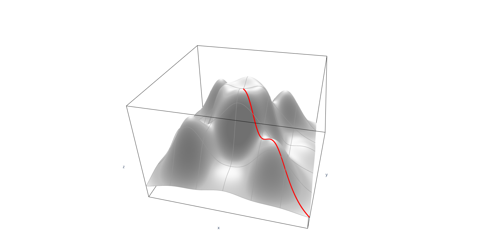

# What are the uses of DOE?

Below are seven examples illustrating situations in which experimental design can be used effectively.

## Choosing Between Alternatives ([Comparative Experiment](https://www.itl.nist.gov/div898/handbook/pri/section3/pri33.htm))

Supplier A vs. supplier B? Which new additive is the most effective? Is catalyst `x' an improvement over the existing catalyst? These and countless other choices between alternatives can be presented to us in a never-ending parade. Often we have the choice made for us by outside factors over which we have no control. But in many cases we are also asked to make the choice. It helps if one has valid data to back up one's decision.

The preferred solution is to agree on a measurement by which competing choices can be compared, generate a sample of data from each alternative, and compare average results. The best average outcome will be our preference. We have performed a comparative experiment!

Sometimes this comparison is performed under one common set of conditions. This is a comparative study with a narrow scope - which is suitable for some initial comparisons of possible alternatives. Other comparison studies, intended to validate that one alternative is preferred over a wide range of conditions, will purposely and systematically vary the background conditions under which the primary comparison is made in order to reach a conclusion that will be proven valid over a broad scope. We discuss experimental designs for each of these types of comparisons in Sections [5.3.3.1](https://www.itl.nist.gov/div898/handbook/pri/section3/pri331.htm) and [5.3.3.2](https://www.itl.nist.gov/div898/handbook/pri/section3/pri332.htm).

## Selecting the Key Factors Affecting a Response ([Screening Experiments](https://www.itl.nist.gov/div898/handbook/pri/section3/pri33.htm#Screening))

Often there are many possible factors, some of which may be critical and others which may have little or no effect on a response. It may be desirable, as a goal by itself, to reduce the number of factors to a relatively small set (2-5) so that attention can be focussed on controlling those factors with appropriate specifications, control charts, etc.

Screening experiments are an efficient way, with a minimal number of runs, of determining the important factors. They may also be used as a first step when the ultimate goal is to model a response with a response surface. We will discuss experimental designs for screening a large number of factors in Sections [5.3.3.3](https://www.itl.nist.gov/div898/handbook/pri/section3/pri333.htm), [5.3.3.4](https://www.itl.nist.gov/div898/handbook/pri/section3/pri334.htm) and [5.3.3.5](https://www.itl.nist.gov/div898/handbook/pri/section3/pri335.htm).

## Response Surface Modeling a Process

Once one knows the primary variables (factors) that affect the responses of interest, a number of additional objectives may be pursued. These include:

* Hitting a Target
* Maximizing or Minimizing a Response
* Reducing Variation
* Making a Process Robust
* Seeking Multiple Goals

What each of these purposes have in common is that experimentation is used to fit a model that may permit a rough, local approximation to the actual surface. Given that the particular objective can be met with such an approximate model, the experimental effort is kept to a minimum while still achieving the immediate goal.

These response surface modeling objectives will now be briefly expanded upon.

###  Hitting a Target 

This is a frequently encountered goal for an experiment.

One might try out different settings until the desired target is hit consistently. For example, a machine tool that has been recently overhauled may require some setup tweaking before it runs on target. Such action is a small and common form of experimentation. However, rather than experimenting in an ad hoc manner until we happen to find a setup that hits the target, one can fit a model estimated from a small experiment and use this model to determine the necessary adjustments to hit the target.

More complex forms of experimentation, such as the determination of the correct chemical mix of a coating that will yield a desired refractive index for the dried coat (and simultaneously achieve specifications for other attributes), may involve many ingredients and be very sensitive to small changes in the percentages in the mix. Fitting suitable models, based on sequentially planned experiments, may be the only way to efficiently achieve this goal of hitting targets for multiple responses simultaneously.

### Maximizing or Minimizing a Response

Many processes are being run at sub-optimal settings, some of them for years, even though each factor has been optimized individually over time. Finding settings that increase yield or decrease the amount of scrap and rework represent opportunities for substantial financial gain. Often, however, one must experiment with multiple inputs to achieve a better output. Section 5.3.3.6 on second-order designs plus material in Section 5.5.3 will be useful for these applications.

<!--  -->
///caption
Figure 1 Pathway up the process response surface to an optimum
///

### Reducing Variation

A process may be performing with unacceptable consistency, meaning its internal variation is too high.

Excessive variation can result from many causes. Sometimes it is due to the lack of having or following standard operating procedures. At other times, excessive variation is due to certain hard-to-control inputs that affect the critical output characteristics of the process. When this latter situation is the case, one may experiment with these hard-to-control factors, looking for a region where the surface is flatter and the process is easier to manage. To take advantage of such flatness in the surface, one must use designs - such as the second-order designs of Section 5.3.3.6 - that permit identification of these features. Contour or surface plots are useful for elucidating the key features of these fitted models. See also 5.5.3.1.4.

<iframe 
    src="/assets/images/unstable.png" 
    width="100%" 
    height="500" 
    frameborder="0" 
    style="display: block; margin: 0 auto;">
</iframe>
<!--  -->
///caption
Figure 2 Process before variation reduced
///

It might be possible to reduce the variation by altering the setpoints (recipe) of the process, so that it runs in a more stable region as expressed in following illustration.

<iframe 
    src="/assets/images/stable.png" 
    width="100%" 
    height="500" 
    frameborder="0" 
    style="display: block; margin: 0 auto;">
</iframe>

Figure 3: Process after variation reduced

Finding this new recipe could be the subject of an experiment, especially if there are many input factors that could conceivably affect the output.

### Making a Process Robust

An item designed and made under controlled conditions will be later field tested in the hands of the customer and may prove susceptible to failure modes not seen in the lab or thought of by design. An example would be the starter motor of an automobile that is required to operate under extremes of external temperature. A starter that performs under such a wide range is termed robust to temperature.

Designing an item so that it is robust calls for a special experimental effort. It is possible to stress the item in the design lab and so determine the critical components affecting its performance. A different gauge of armature wire might be a solution to the starter motor, but so might be many other alternatives. The correct combination of factors can be found only by experimentation.

### Seeking Multiple Goals

A product or process seldom has just one desirable output characteristic. There are usually several, and they are often interrelated so that improving one will cause a deterioration of another. For example: rate vs. consistency; strength vs. expense; etc.

Any product is a trade-off between these various desirable final characteristics. Understanding the boundaries of the trade-off allows one to make the correct choices. This is done by either constructing some weighted objective function (`desirability function') and optimizing it, or examining contour plots of responses generated by a computer program, as given below.

///caption
FIGURE 4  Overlaid contour plot of Deposition Rate and Capability (Cp)
///

## Regression Modeling

Sometimes we require more than a rough approximating model over a local region. In such cases, the standard designs presented in this chapter for estimating first- or second-order polynomial models may not suffice. Chapter 4 covers the topic of experimental design and analysis for fitting general models for a single explanatory factor. If one has multiple factors, and either a nonlinear model or some other special model, the computer-aided designs of Section 5.5.2 may be useful.
